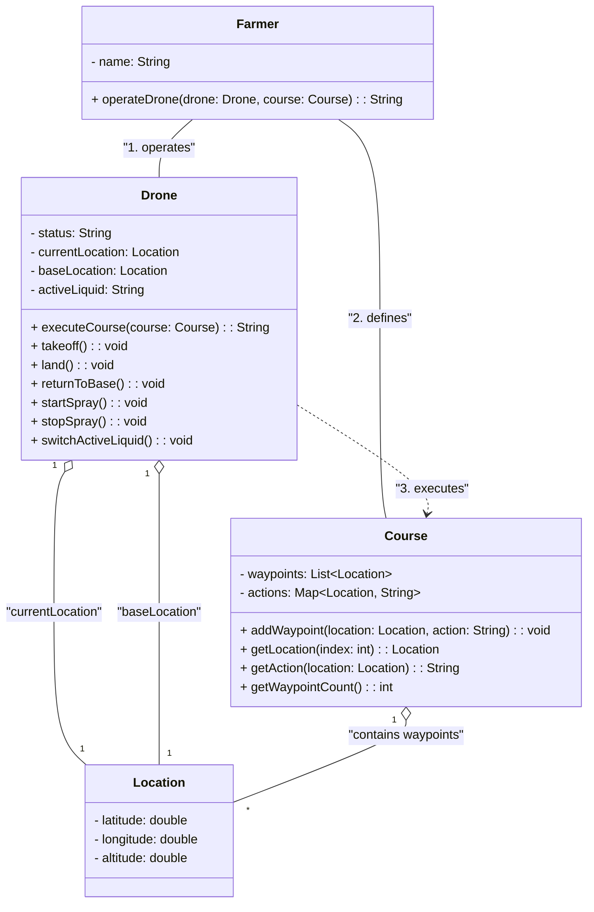

# ドローン制御システム開発プロジェクト

## プロジェクト概要

hakoniwa-drone-core（OSSリポジトリ）を使用して、農薬散布用ドローン制御システムを開発しています。
メインの実行ファイルは`/home/naotelu/my-drone`に配置し、hakoniwa-drone-coreの設定ファイルを参照して実行します。
hakoniwa-drone-core側にはラッパースクリプトを配置し、メインの実行ファイルを呼び出す構成です。

## 現在の状況
Assetsファイルには畑のデータが入っているので、これを活用して3Dデータを取得してください。

### リポジトリ構成

1. **hakoniwa-drone-core** (OSSリポジトリ)
   - パス: `/home/naotelu/hakoniwa/hakoniwa-drone-core`
   - 所有者: toppers (GitHub)
   - 用途: ドローンシミュレーションのコア機能
   - 設定ファイル: `config/pdudef/webavatar.json`
   - 既存の実行ファイル例: `drone_api/rc/api_control_sample.py`
   - ラッパースクリプト: `drone_api/rc/farmer_control.py` (作成予定)

2. **my-drone** (独自リポジトリ - メイン実行ファイル)
   - パス: `/home/naotelu/my-drone`
   - 用途: メインの実行ファイルとクラス実装
   - GitHubで共有可能な独立したリポジトリ
   - 現在の状態: README.mdのみ存在

### 目標

- `/home/naotelu/my-drone`にクラス図に基づいた実装を作成（メイン実行ファイル）
- hakoniwa-drone-coreの設定ファイルを絶対パスで参照
- hakoniwa-drone-coreの`drone_api/rc/`にラッパースクリプトを配置
- hakoniwa-drone-coreのディレクトリから実行可能にする

## ファイル構成（実装予定）

```
/home/naotelu/my-drone/                    # メイン実行ファイル（GitHub共有用）
|__Assets/ (畑データ用)
|
├── classes/
│   ├── __init__.py
│   ├── location.py      # Locationクラス
│   ├── course.py        # Courseクラス
│   ├── drone.py         # Droneクラス
│   └── farmer.py        # Farmerクラス
├── main.py              # メイン実行ファイル（エントリーポイント）
├── requirements.txt     # 依存パッケージ
└── README.md

/home/naotelu/hakoniwa/hakoniwa-drone-core/  # OSSリポジトリ
├── config/
│   └── pdudef/
│       └── webavatar.json  # 設定ファイル（絶対パスで参照）
└── drone_api/
    └── rc/
        ├── api_control_sample.py  # 既存の実行ファイル例（参考用）
        └── farmer_control.py      # ラッパースクリプト（メイン実行ファイルを呼び出す）
```

## クラス構成（クラス図）



## 実装要件

### 参考ファイル: `api_control_sample.py`

hakoniwa-drone-coreの`drone_api/rc/api_control_sample.py`を参考に実装してください。
このファイルの主な実装パターン：
- 接続パターン: `hakosim.MultirotorClient`を使用して接続、`confirmConnection()`、`enableApiControl()`、`armDisarm()`を実行
- 離陸: `client.takeoff()`を使用
- 移動: `client.moveToPosition()`を使用
- 位置情報取得: `client.simGetVehiclePose()`を使用
- 着陸: `client.land()`を使用
- タイミング制御: `time.sleep()`で適切に待機

### 1. Locationクラス (`/home/naotelu/my-drone/classes/location.py`)
- 属性: latitude, longitude, altitude (すべてfloat)
- 座標情報を保持
- `to_dict()`メソッド: hakoniwa-drone-coreのAPI用に辞書形式で返す

### 2. Courseクラス (`/home/naotelu/my-drone/classes/course.py`)
- 属性: waypoints (List[Location]), actions (Dict[Location, str])
- メソッド:
  - `addWaypoint(location: Location, action: str)`
  - `getLocation(index: int) -> Location`
  - `getAction(location: Location) -> str`
  - `getWaypointCount() -> int`

### 3. Droneクラス (`/home/naotelu/my-drone/classes/drone.py`)
- 属性: status, currentLocation, baseLocation, activeLiquid
- hakoniwa-drone-coreの`hakosim.MultirotorClient`を使用
- `api_control_sample.py`の実装パターンを参考にする
- メソッド:
  - `takeoff()`: `client.takeoff()`を使用、`time.sleep(1)`で待機
  - `land()`: `client.land()`を使用、`time.sleep(2)`で待機
  - `returnToBase()`: `client.moveToPosition()`で基地に移動後、着陸
  - `startSpray()`: 散布開始（必要に応じて`grab_baggage(True)`を参考）
  - `stopSpray()`: 散布停止（必要に応じて`grab_baggage(False)`を参考）
  - `switchActiveLiquid(liquid: str)`: 散布液切り替え
  - `executeCourse(course: Course) -> str`: コース実行
  - `debug_pos()`: `api_control_sample.py`の`debug_pos()`関数を参考に実装

### 4. Farmerクラス (`/home/naotelu/my-drone/classes/farmer.py`)
- 属性: name (String)
- メソッド: `operateDrone(drone: Drone, course: Course) -> str`

### 5. main.py (メイン実行ファイル - `/home/naotelu/my-drone/main.py`)
- **これがメインの実行ファイル**
- `api_control_sample.py`の`main()`関数を参考に実装
- hakoniwa-drone-coreの設定ファイルを絶対パスで参照
- デフォルトパス: `/home/naotelu/hakoniwa/hakoniwa-drone-core/config/pdudef/webavatar.json`
- コマンドライン引数で上書き可能
- hakoniwa-drone-coreの`hakosim.MultirotorClient`を使用して接続
- GitHubで共有可能な独立したファイル

### 6. farmer_control.py (ラッパースクリプト - hakoniwa-drone-core側)
- パス: `/home/naotelu/hakoniwa/hakoniwa-drone-core/drone_api/rc/farmer_control.py`
- 役割: メイン実行ファイル（`/home/naotelu/my-drone/main.py`）を呼び出すラッパー
- hakoniwa-drone-coreのディレクトリから実行するためのヘルパースクリプト

## 実行方法

### 方法1: メイン実行ファイルを直接実行

```bash
cd /home/naotelu/my-drone
python3 main.py /home/naotelu/hakoniwa/hakoniwa-drone-core/config/pdudef/webavatar.json
```

### 方法2: hakoniwa-drone-coreのラッパースクリプトから実行（推奨）

hakoniwa-drone-coreの`drone_api/rc/`にラッパースクリプト`farmer_control.py`を作成。
このスクリプトはメイン実行ファイル（`/home/naotelu/my-drone/main.py`）を呼び出し、設定ファイルのデフォルトパスを自動的に設定する。

実行：

```bash
cd /home/naotelu/hakoniwa/hakoniwa-drone-core/drone_api/rc
python3 farmer_control.py
# または設定ファイルを指定
python3 farmer_control.py ../../config/pdudef/webavatar.json
```

## 重要な設定とパス

### 絶対パス
- hakoniwa-drone-core設定ファイル: `/home/naotelu/hakoniwa/hakoniwa-drone-core/config/pdudef/webavatar.json`
- my-droneディレクトリ（メイン実行ファイル）: `/home/naotelu/my-drone`
- hakoniwa-drone-coreディレクトリ: `/home/naotelu/hakoniwa/hakoniwa-drone-core`
- メイン実行ファイル: `/home/naotelu/my-drone/main.py`
- ラッパースクリプト: `/home/naotelu/hakoniwa/hakoniwa-drone-core/drone_api/rc/farmer_control.py`
- 参考ファイル: `/home/naotelu/hakoniwa/hakoniwa-drone-core/drone_api/rc/api_control_sample.py`

### 依存パッケージ
- `hakoniwa-pdu`: hakoniwa-drone-coreのPython API
- `numpy`: 数値計算

### hakoniwa-drone-coreのAPI使用例（api_control_sample.pyより）

`api_control_sample.py`を参考に、以下の機能を使用：
- `hakosim.MultirotorClient`で接続
- `client.takeoff()`で離陸
- `client.moveToPosition()`で移動
- `client.simGetVehiclePose()`で位置情報取得
- `client.land()`で着陸

## 実装時の注意点

**重要**: このREADMEに記載されている情報は、作成時点での情報です。実装時には以下の点を必ず確認してください：
- 実際のファイルパスやディレクトリ構造が正しいか確認する
- hakoniwa-drone-coreの最新のAPI仕様や実装パターンを確認する
- `api_control_sample.py`などの参考ファイルの最新の内容を確認する
- 必要に応じてhakoniwa-drone-coreのドキュメントやソースコードを参照する
- 情報が古くなっている可能性があるため、随時最新の情報や正しい情報を確認して実装する

1. **メイン実行ファイル**: `/home/naotelu/my-drone/main.py`がメインの実行ファイル
2. **参考ファイル**: `api_control_sample.py`の実装パターンを必ず参考にする
3. **設定ファイルパス**: メイン実行ファイル内で絶対パスで参照（hakoniwa-drone-coreの設定ファイル）
4. **ラッパースクリプト**: hakoniwa-drone-core側はメイン実行ファイルを呼び出すだけのラッパー
5. **座標系**: hakoniwa-drone-coreはROS座標系（FLU: Forward-Left-Up）を使用
6. **タイミング制御**: `api_control_sample.py`と同様に`time.sleep()`で適切に待機する
7. **エラーハンドリング**: 設定ファイルの存在確認、ドローンの状態管理を実装
8. **GitHub共有**: `/home/naotelu/my-drone`は独立したリポジトリとしてGitHubで共有可能

## 実装の優先順位

1. `/home/naotelu/my-drone/classes/`配下のクラス実装
   - `location.py` → `course.py` → `drone.py` → `farmer.py`の順
2. `/home/naotelu/my-drone/main.py`の実装
   - `api_control_sample.py`の`main()`関数を参考に
3. `/home/naotelu/my-drone/requirements.txt`の作成
4. hakoniwa-drone-coreの`drone_api/rc/farmer_control.py`の作成（ラッパー）

## 次のステップ

1. `/home/naotelu/my-drone`にクラス実装を作成（メイン実行ファイル）
2. `main.py`でhakoniwa-drone-coreのAPIを使用してドローン制御を実装（`api_control_sample.py`を参考）
3. hakoniwa-drone-coreの`drone_api/rc/`にラッパースクリプト`farmer_control.py`を作成
4. テスト実行して動作確認
